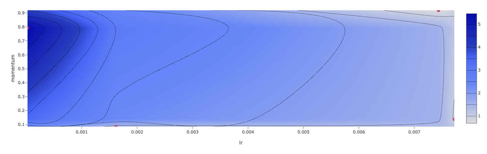

## END-TO-END DEEP LEARNING CONSTRUCTION

Given the characteristics of white wine, the software predicts its quality in range of 10.

## Table of Contents

- Run a hyperparameter sweep on a training script

- Compare the results of the runs in the MLflow UI

- Choose the best run and register it as a model (best-wine-quality model)

- Deploy the model to a REST API (future work)

- Build a container image suitable for deployment to a cloud platform (future work)

## 1. Hyperparameter Sweep

The investigated hyperparameters are __learning rate__ and __momentum__. In the [notebook](starter.ipynb), the selection in hyperparameter values are uniform. 

The given loss function is __Root Mean Square Error__.

## 2. Result Comparison
The result from MLlfow UI is shown below. 

## 3. Model Selection
The best model is one whose __lr__ is 0.0074 and __momentum__ is 0.92.

 
