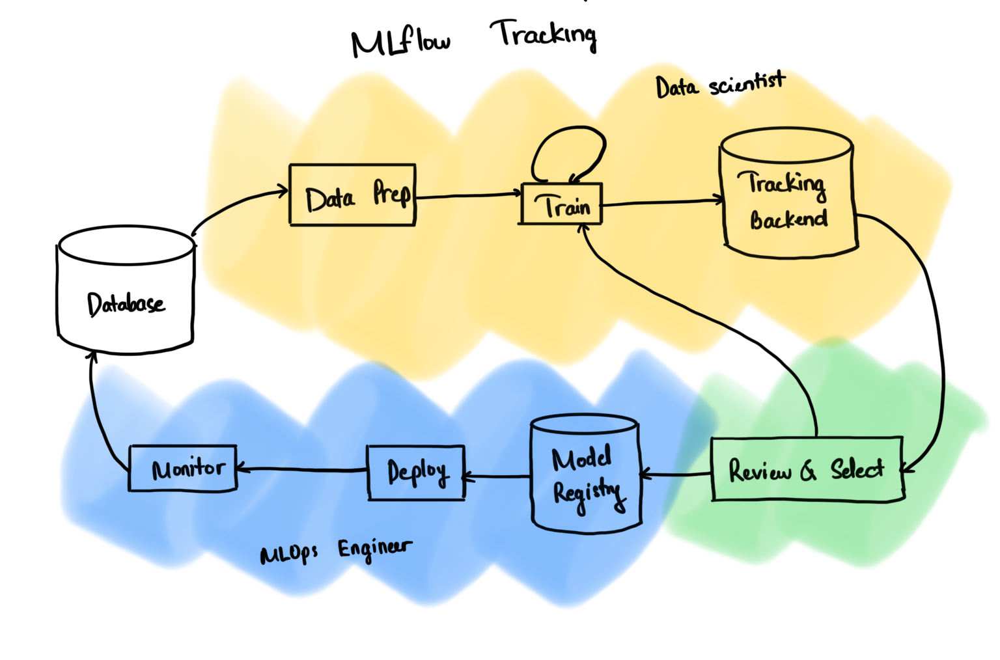

## END-TO-END DEEP LEARNING CONSTRUCTION

### Outline: Compare runs, choose a model, and deploy it to a REST API

In this starter, I will:

- Run a hyperparameter sweep on a training script

- Compare the results of the runs in the MLflow UI

- Choose the best run and register it as a model

- Deploy the model to a REST API

- Build a container image suitable for deployment to a cloud platform

